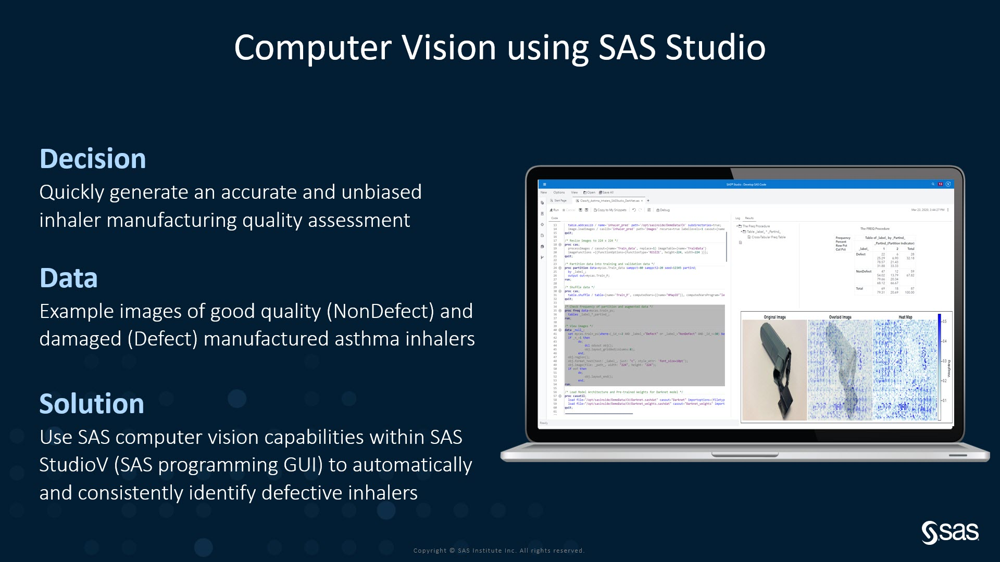
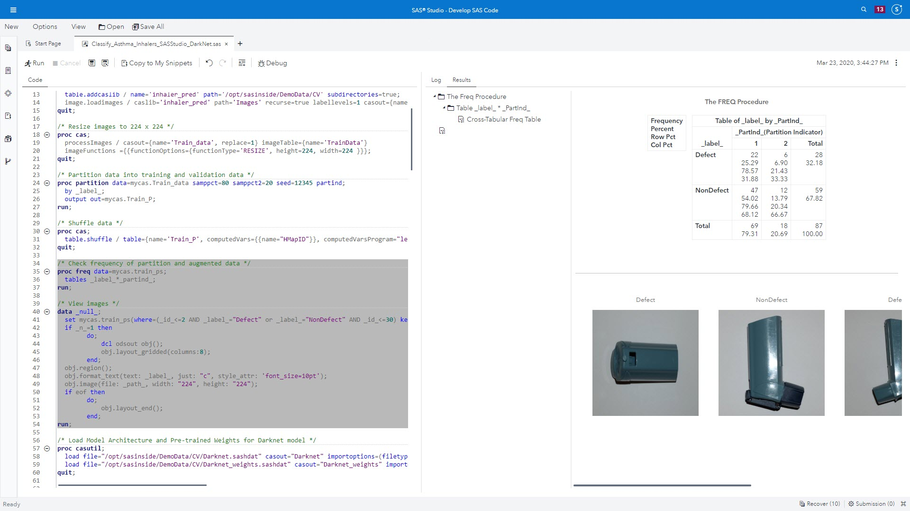
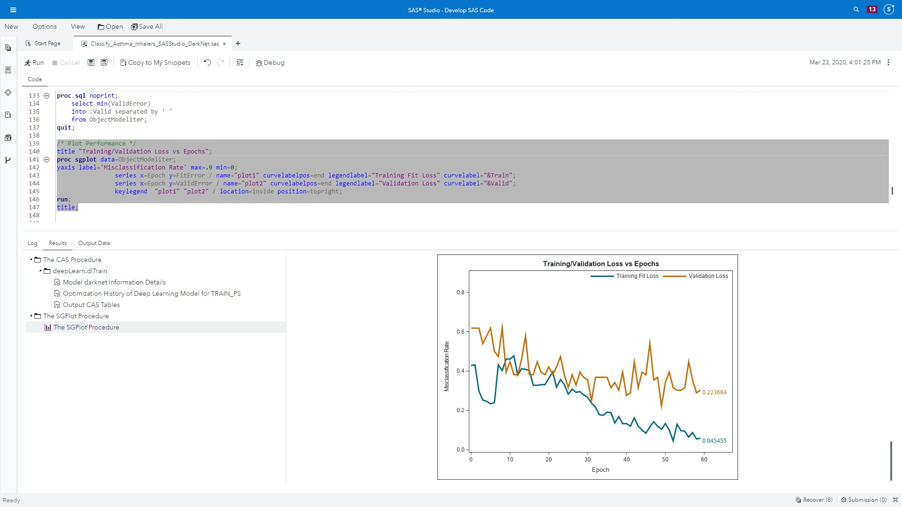
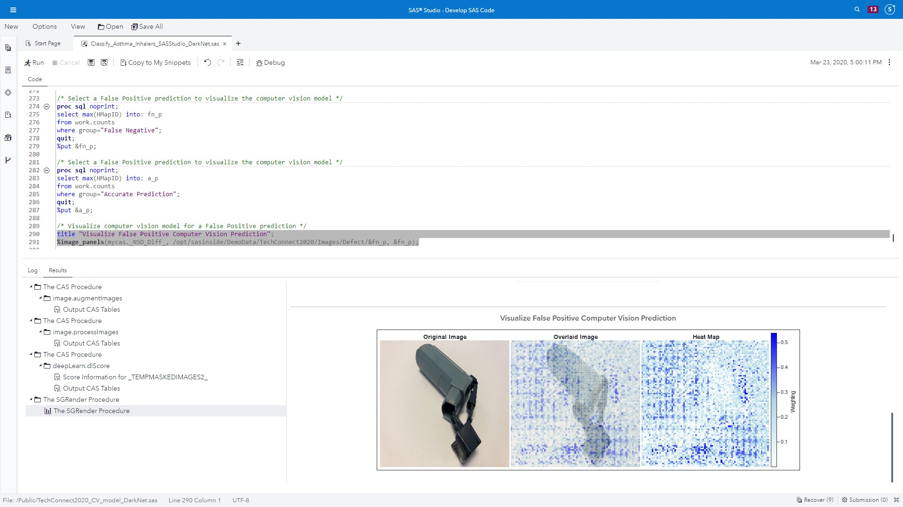

This demo was originally created for the 2020 SGF Tech Connect section. 

Since the original POC images could not be shared, these pictures and code were created to simulate how a large, international medical device manufacturer benefited from using SAS image recognition capabilities.

This is an example of performing SAS computer vision within a SAS programmatic GUI, namely SAS StudioV. The code is uploaded in this GitLab project and on the EEC171 RACE image in "SAS Content > Public > Programming Examples > ComputerVision > Classify_Asthma_Inhalers_SASStudio_DarkNet.sas"

For best results, more images of defects and nondefects are needed. Also, an environment with GPUs will greatly speed up compute time. 

Custom code was added to visualize a false negative prediction and an acurrate prediction using Proc SGPlot. The custom code shows the original image, the computer vision prediction heatmap overlayed with the original image, and then the computer vision decision heatmap (see attached code).

The intent of this demo is to show how SAS computer vision offers the promise of higher level of quality control accuracy, that remains consistent and unbiased, with the ability to scale as production throughput increases.
